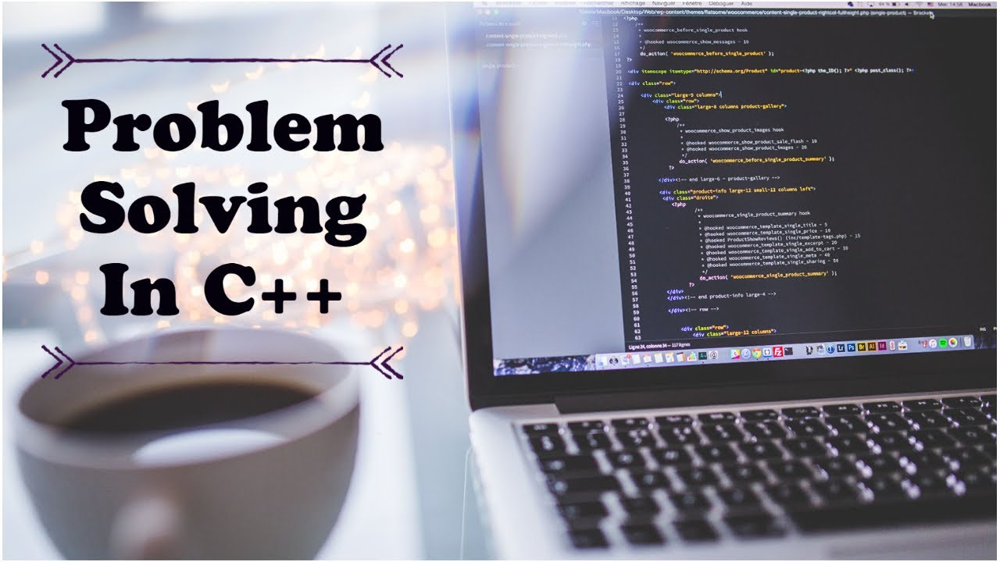

# PROGRAMMING $ PROBLEM SOLVING WITH C++ 

## Part-A 

### Unit-1 Introduction to Computer Fundamentals 
[Computer System Components: Input and Output Devices, Memory and Storage Devices, Block diagram of 
Computer System, Types of So ware, Operating System with its types, 
Compiler, Interpreter, Assembler, Linker, Loader.](https://cg2024-gndec.github.io/ppsnotes/#introduction-to-computer-fundamentals) 

### Unit-2 Basics of Programming Idea of Algorithm:  

[Steps to solve logical and numerical problems. Algorithms, Flowchart, 
Pseudocode with examples. Basic C++ Program, Compile and Execute C++ 
program, Character Set, Tokens-Identifiers, Keywords, Variables, Literals, 
Constants, Data Types, Different types of errors.](https://cg2024-gndec.github.io/ppsnotes/#basics-of-programming-idea-of-algorithm)  

### Unit-3 Operators 
[Different types of Operators: Assignment Operators, Numeric operators, Prefix and postfix operators, Binary 
number system, Bitwise operators, Logical operators, Relational operators, 
Short-circuit operators, sizeof operator, Operator precedence and associativity. 
Type conversion.](https://cg2024-gndec.github.io/ppsnotes/#operators)  

### Unit-4 Control Structures 
[Conditional Statements: if, if-else, conditional operator (?:), switch and nested decision statements; 
Looping Statements: for, while, do-while, Nested Loops, and Controlling loop 
execution keywords: break, con nue, goto keyword and labeled statements 
mul ple-selection keywords: switch, case, default keywords](https://cg2024-gndec.github.io/ppsnotes/#control-structures) 

## Part-B 

### Unit-5 Functions:  

[Functions: Need of functions, Components of Functions, Built-in and User 
Defined Functions, Parameter passing in function: Call by value, Call by 
reference, Scope rules, Default Arguments, Function Overloading, Recursion: 
Base case and recursive case, Recursion versus Iteration.](https://cg2024-gndec.github.io/ppsnotes/#functions)  

### Unit-6 Arrays:  

[Arrays: Single-Dimensional and Multi-Dimensional arrays, Array operations, 
Character array and strings literals, string literals declaring, initializing, and 
using strings basic string operations, comparing strings; Pointers: declaring and 
initializing pointers.](https://cg2024-gndec.github.io/ppsnotes/#arrays)  

### Unit-7 Structures and Unions 
[Structures: Need and syntax of structures, Structure Operations- Passing and returning 
structures from functions, Nested Structures, Array of Structures, typedef, 
Union, Structure versus Union.](https://cg2024-gndec.github.io/ppsnotes/#structures-and-unions)
